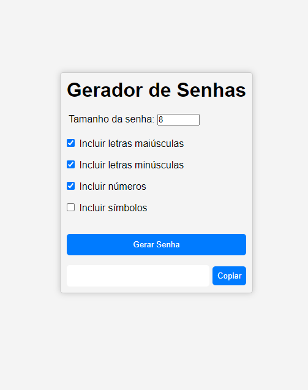

# Gerador de Senhas

> Status do Projeto: em desenvolvimento...

## Descrição do Projeto

O projeto consiste em um gerador de senhas, onde o usuário pode escolher o tamanho da senha e quais caracteres deseja incluir.

## Funcionalidades

- [x] Gerar senha
- [x] Copiar senha para a área de transferência

## Tecnologias

As seguintes ferramentas foram usadas na construção do projeto:

- HTML
- CSS
- JavaScript

## Imagem do Projeto ✨

 Acesse a aplicação pelo link: [Gerador de Senhas](https://alancamposdev.github.io/password-generator/)

